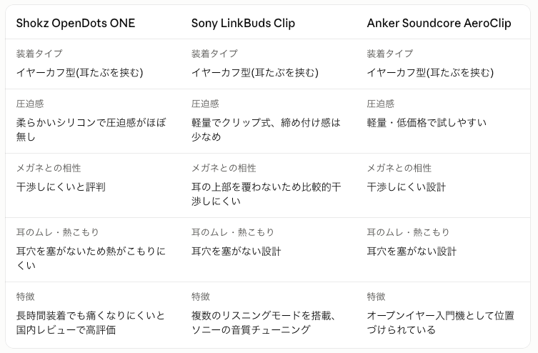

お仕事中の集中用ですね。条件を整理すると「オープンイヤー型(耳を塞がない・挟まないタイプ)」がかなり合いそうです。理由も含めて調べてみます。条件を整理すると、耳を塞がずに耳たぶに軽く挟む「イヤーカフ型」のイヤホンが一番合いそうです。

- 耳の中を塞がないので熱がこもりにくい
- 耳を挟む力が弱く、メガネのつるとも干渉しにくい
- 音量を上げすぎなければ音漏れも小さく、家族がいる部屋でもそこそこプライベートに聴ける
- 一方でスピーカーほどではないが「完全な遮音」ではない点は理解しておくと良いです

その方向で候補を3つ挙げます。

選び方の目安です。

- **とにかく圧迫感ゼロを重視するなら Shokz OpenDots ONE**。実際のレビューでも「長時間つけても痛くならない」という声が多いです。
- **音質やモード切替の柔軟さを重視するなら Sony LinkBuds Clip**。用途に応じたリスニングモードが使えます。
- **まずは低価格で試したいなら Anker Soundcore AeroClip**。イヤーカフ型の入門機として位置づけられています。

正直なところ、装着感の好みは個人差が大きい部分なので、可能であれば家電量販店で試着してから決めるのが一番確実です。分からない点があれば、一緒に整理しましょう。