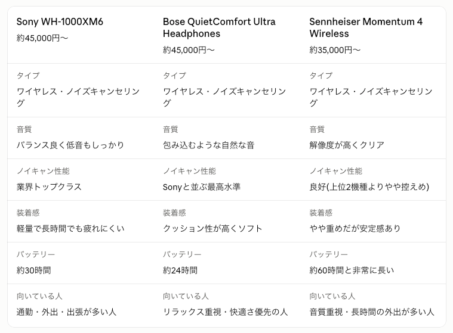

特にこだわりがないとのことなので、幅広い用途で人気が高く、失敗しにくい定番モデルを3つ挙げますね。

迷ったら、まずは**Sony WH-1000XM6**が総合力・ノイキャン性能ともに安心です。装着感やリラックス優先なら**Bose**、音質を特に重視するなら**Sennheiser**も良い選択肢です。

もし予算をもっと抑えたい、または有線タイプがいい、といったご希望があれば教えてください。